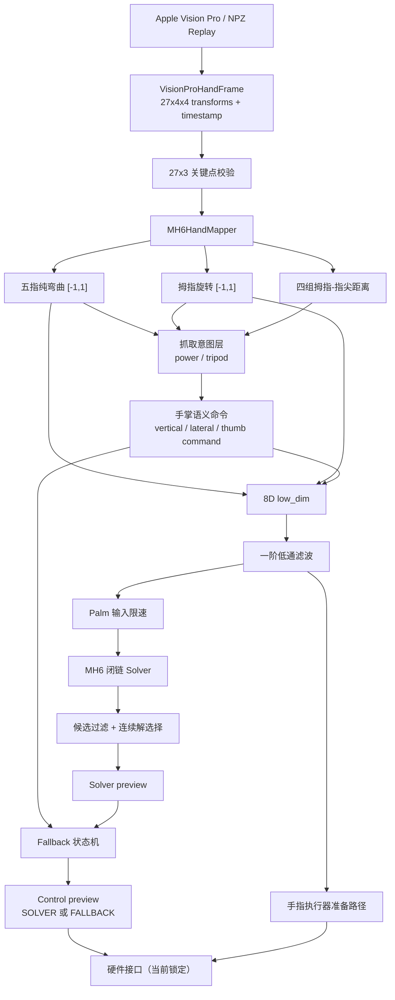

# MH6 右手遥操作映射与控制框架 Handoff

> 更新：运行入口已默认接入新 `PalmSolverAdapter`。本文第 13 节保留了旧版
> Solver 的映射说明；当前新入口、三轴方向、自然位和参数传递以
> [三轴遥操作到新 Palm Solver 的适配](mh6_palm_solver_adapter.md) 为准。
> `--palm-solver legacy` 使用当前兼容入口的位置顺序
> `(vertical, thumb_rotation_command, lateral)`。

## 1. 文档目的

本文档面向后续接手 MH6 右手遥操作项目的开发者，描述当前代码实际实现的：

- Apple Vision Pro 手部数据如何进入系统；
- 人手五指弯曲、拇指旋转和对指距离如何计算与标定；
- 原始特征如何组合成力量型抓持、三指精确抓持和跨掌对指意图；
- 手指和手掌命令如何形成；
- 手掌闭链 Solver、多解选择、无解 fallback 如何协作；
- 滤波、限速、日志、录制回放和硬件接口分别处于哪一层；
- 当前哪些部分已经实现，哪些仍是打印验证或待重新建模。

当前所有遥操作映射都以**右手**为目标。程序入口是：

```text
DHandControl/scripts/mh6_teleop_run.py
```

## 2. 一句话理解当前方案

当前方案不是把人手关节逐一重定向到机器人关节，而是：

> 从人手骨架提取“纯手指弯曲、拇指旋转、各指对指距离”等低维特征，再组合出抓取意图和手掌翻折意图，最后把手指意图映射到五个直线电缸，把手掌意图交给闭链 Solver；Solver 长时间无解时，预览层退化为一个整手同步开合轨迹。

设计中最重要的分层原则是：

1. **纯手指弯曲不混入指尖距离。**
2. **指尖距离独立保留，用来推断精确抓持和跨掌对指。**
3. **拇指弯曲和拇指旋转是两个独立量。**
4. **抓取意图是由原始特征组合出来的派生量，不覆盖原始特征。**
5. **手掌语义命令与闭链机构求解分层。** 当前两者之间仍采用临时的一一对应映射，这是后续最重要的建模工作。

## 3. 端到端控制框架



运行时每个有效帧的主要顺序是：

```text
Frame
→ Mapping 原始结果
→ CommandLowPassFilter
→ PalmInputSlewLimiter
→ MH6PalmSolver
→ PalmSolutionSelector
→ PalmFallbackController
→ 控制台 / JSONL 日志
→ HardwareSender（当前入口被显式禁止）
```

## 4. 输入数据和关键点约定

### 4.1 数据源

实时模式使用 `VisionProHandStream`，从 `avp_stream.VisionProStreamer` 读取右手 transforms。

回放模式使用 `ReplayHandStream`，读取先前录制的 NPZ。实时和回放最终都产生相同结构：

```python
VisionProHandFrame(
    points,       # shape: (27, 3)
    transforms,   # shape: (27, 4, 4)
    timestamp,
    hand="right",
)
```

输入校验包括：

- 至少有 27 个 `4×4` 变换矩阵；
- 所有值有限；
- 关键点不能全部为零；
- 手腕到最远指尖的距离在 `0.02m～0.50m` 内。

### 4.2 关键点索引

当前 Mapping 使用的索引如下：

| 部位 | 索引 |
|---|---:|
| wrist | 0 |
| thumb joints / tip | 1, 2, 3, 4 |
| index joints / tip | 5, 6, 7, 8, 9 |
| middle joints / tip | 10, 11, 12, 13, 14 |
| ring joints / tip | 15, 16, 17, 18, 19 |
| little joints / tip | 20, 21, 22, 23, 24 |

映射主要使用相邻骨段向量、局部掌面方向和指尖距离，因此对全局平移不敏感；拇指旋转使用掌部局部坐标系，因此也不依赖手掌在世界坐标中的整体朝向。

## 5. 初始标定

标定分两个阶段，并且录制文件也按同样的三个 phase 保存：`neutral`、`range`、`teleop`。

### 5.1 自然姿态标定

默认采集 `2s`。操作者保持右手自然放松，不刻意过伸、抓握或对掌。

对自然阶段的全部样本取中位数，得到：

- 每根手指自然弯曲角 `curl_open[finger]`；
- 拇指到食指/中指/无名指/小指的自然距离；
- 右手拇指自然旋转角 `thumb_rotation_open`。

这里的 `open` 是历史兼容命名，当前物理含义是 **neutral / natural**，不是“完全张开”。

### 5.2 运动范围标定

默认采集 `8s`。操作者快速做两次：

```text
过度伸直 → 完整抓合 → 过度伸直 → 完整抓合
```

为降低追踪毛刺影响，不直接使用最小值和最大值，而使用：

- 5% 分位数：低边界；
- 95% 分位数：高边界。

不同特征的方向不同：

| 特征 | outward | inward |
|---|---|---|
| 手指弯曲角 | 较小 | 较大 |
| 拇指-指尖距离 | 较大 | 较小 |
| 拇指旋转角 | 较小 | 较大 |

若某一侧没有形成有效运动范围，代码不会制造一个虚假的饱和值；该侧退化时返回 0。

## 6. 双段有符号归一化

所有有方向的基础运动量使用：

```text
-1 = 过度向外 / 过伸
 0 = 自然姿态
+1 = 向内 / 弯曲 / 对掌
```

自然点两侧独立缩放，而不是把完整范围一次线性映射到 `[-1,1]`。

对“数值越大越向内”的特征，例如弯曲角和拇指旋转角：

```text
value < neutral:
    u = (value - neutral) / (neutral - outward)

value >= neutral:
    u = (value - neutral) / (inward - neutral)

u = clip(u, -1, 1)
```

对“距离越小越向内”的拇指-指尖距离，方向反过来：

```text
distance > neutral:
    p_signed = -(distance - neutral) / (outward - neutral)

distance <= neutral:
    p_signed = (neutral - distance) / (neutral - inward)
```

双段映射的意义是：自然状态固定为 0；向外张开和向内抓合分别使用自己的实际活动范围，不要求人体自然位恰好处在总行程中点。

## 7. 手指映射

### 7.1 原始弯曲量

对每根手指，依次构造相邻骨段向量，并将相邻骨段的夹角相加：

```text
curl_finger = Σ angle(bone_i, bone_i+1)
```

因此：

- 手指越直，角度和越小；
- 手指越弯，角度和越大。

五根手指分别归一化为：

```text
u_thumb
u_index
u_middle
u_ring
u_little
```

范围均为 `[-1,1]`。

### 7.2 弯曲与对指彻底分离

当前代码明确规定：

```text
u_finger = 纯弯曲归一化值
```

拇指与其他指尖靠近不会直接改变 `u_index/u_middle/u_ring/u_little`。这样做是为了避免：

- 手指没有弯曲、只是空间上靠近时被误判为弯曲；
- 对指距离变化覆盖真实的关节弯曲状态；
- 后续无法区分“整手包络”和“指尖精确操作”。

### 7.3 当前准备好的硬件映射

`HardwareSender` 当前会先取：

```python
max(u_finger, 0.0)
```

再把 `0..1` 线性映射到每个手指电缸：

```text
open = 20
closed = 1950
position = open + u * (closed - open)
```

因此当前准备路径中：

- `u=0` → 20；
- `u=1` → 1950；
- `u<0` 被截成 0，尚不能驱动机器人手指做“比自然位更向外”的动作。

这只是硬件准备代码；`mh6_teleop_run.py` 当前会拒绝 `--enable-hardware`，不会实际发送。

## 8. 拇指旋转映射

拇指旋转与拇指弯曲分开计算。

### 8.1 掌部局部坐标系

右手掌面建立两个方向：

```text
thumb_side = normalize(index_base - little_base)
palm_forward = normalize(project(wrist → middle_base, perpendicular to thumb_side))
```

拇指近端方向：

```text
thumb_proximal = thumb_joint_2 - thumb_joint_1
```

将其投影到掌面，计算：

```text
raw_thumb_rotation = atan2(
    dot(thumb_proximal, palm_forward),
    dot(thumb_proximal, thumb_side)
)
```

再经过双段标定得到：

```text
u_thumb_rotation ∈ [-1,1]
```

含义是：

- `-1`：拇指向外偏转；
- `0`：自然位置；
- `+1`：拇指向掌心、向小指侧对掌。

## 9. 对指距离与抓取意图

### 9.1 四组原始距离

计算拇指指尖到四根长手指指尖的欧氏距离：

```text
d_I = distance(thumb_tip, index_tip)
d_M = distance(thumb_tip, middle_tip)
d_R = distance(thumb_tip, ring_tip)
d_L = distance(thumb_tip, little_tip)
```

每组距离产生三层表示：

1. `opposition_signed`：`[-1,1]`，距离增大为负、距离减小为正；
2. `opposition_proximity`：`max(signed, 0)`，自然位开始连续增大的靠近量；
3. `opposition`：对 proximity 应用 dead zone 后的明确对指意图。

默认 dead zone 为 `0.35`：

```text
p <= 0.35: intent = 0
p > 0.35:  intent = (p - 0.35) / (1 - 0.35)
```

### 9.2 力量型抓持 power grasp

只取五指弯曲的正半轴：

```text
c_finger = clip(u_finger, 0, 1)
```

默认权重：

| 手指 | 权重 |
|---|---:|
| thumb | 0.15 |
| index | 0.20 |
| middle | 0.25 |
| ring | 0.22 |
| little | 0.18 |

计算：

```text
power_grasp = Σ(weight_i * c_i) / Σ(weight_i)
```

物理意义是整手包络/力量型抓持。单指弯曲只贡献一部分，五指共同弯曲才接近 1。

### 9.3 三指精确抓持 tripod precision

当前不使用速度或时间趋势，只使用“同时弯曲 + 同时靠近”：

```text
tripod_flexion = min(c_thumb, c_index, c_middle)
tripod_proximity = min(proximity_I, proximity_M)
tripod_precision = min(tripod_flexion, tripod_proximity)
```

这里使用未经过 dead zone 的连续 `opposition_proximity`，因此可以表达三指距离同步减小的早期趋势。

只有当拇指、食指、中指都弯曲，并且拇指同时靠近食指和中指时，三指精确意图才会升高。

### 9.4 跨掌对指 opposition cross

四根手指都能推动手掌左右翻折，但无名指和小指权重更高：

| 对指 | 权重 |
|---|---:|
| thumb-index | 0.15 |
| thumb-middle | 0.30 |
| thumb-ring | 0.75 |
| thumb-little | 1.00 |

计算使用加权最大值，而不是求和：

```text
opposition_cross = max(
    0.15*p_I,
    0.30*p_M,
    0.75*p_R,
    1.00*p_L
)
```

这样可以避免拇指靠近某一根手指时，相邻多组距离同时减小而重复累计。

## 10. 两个手掌翻折量

当前语义约定必须保持一致：

- **上下翻折 `vertical / u_h`**：从手指完全伸直到完全弯曲的方向；正方向主要服务整手包络和三指捏取辅助。
- **左右翻折 `lateral / u_v`**：大拇指侧朝小拇指侧靠近的跨掌方向；正方向主要服务对指，尤其是无名指、小指对指。

两者都是 `[-1,1]`：

```text
-1 = 主动向外 / 向后展开
 0 = 自然状态
+1 = 向内翻折
```

### 10.1 上下翻折

正方向：

```text
vertical_positive = clip(
    1.00 * power_grasp
  + 0.35 * tripod_precision,
    0,
    1
)
```

负方向使用五指负弯曲量的同一组加权平均：

```text
vertical_negative = weighted_mean(min(u_finger, 0))
```

最终不把正负候选简单相加，而是选择绝对值更大的方向：

```text
vertical = dominant_direction(vertical_negative, vertical_positive)
```

这样“主动过伸”和“抓取辅助”不会互相抵消成一个看似中性的命令。

### 10.2 左右翻折

正方向：

```text
lateral_positive = clip(
    0.10 * power_grasp
  + 1.00 * opposition_cross,
    0,
    1
)
```

因此力量型抓持只提供少量左右协同，跨掌对指是主要来源。

负方向同时参考：

- 拇指主动向外旋转；
- 拇指与其他指尖距离主动增大，并按跨掌权重加权。

```text
outward_distance = min(weight_i * min(p_signed_i, 0))
lateral_negative = min(
    min(u_thumb_rotation, 0),
    0.35 * outward_distance
)
lateral = dominant_direction(lateral_negative, lateral_positive)
```

### 10.3 三指抓取的拇指旋转补偿

为了帮助三指捏取，在测得的拇指旋转基础上增加有限补偿：

```text
thumb_compensation = 0.35
                   * tripod_precision
                   * (1 - max(thumb_rotation_measured, 0))

thumb_rotation_command = clip(
    thumb_rotation_measured + thumb_compensation,
    -1,
    1
)
```

如果操作者已经主动完成向内旋转，补偿会自动减小，不会固定叠加同样的量。

## 11. low_dim 数据定义

最终 8 维低维向量为：

```text
[
  u_thumb,
  u_thumb_rotation,
  u_index,
  u_middle,
  u_ring,
  u_little,
  u_h,
  u_v,
]
```

| 字段 | 范围 | 含义 |
|---|---:|---|
| `u_thumb` | `[-1,1]` | 拇指纯弯曲 |
| `u_thumb_rotation` | `[-1,1]` | 拇指向外/自然/向内对掌旋转 |
| `u_index` | `[-1,1]` | 食指纯弯曲 |
| `u_middle` | `[-1,1]` | 中指纯弯曲 |
| `u_ring` | `[-1,1]` | 无名指纯弯曲 |
| `u_little` | `[-1,1]` | 小指纯弯曲 |
| `u_h` | `[-1,1]` | 手掌上下翻折，即 `vertical` |
| `u_v` | `[-1,1]` | 手掌左右翻折，即 `lateral` |

注意：交给 Palm Solver 的第三个输入不是 low_dim 中原始的 `u_thumb_rotation`，而是可能含三指补偿的 `thumb_rotation_command`。

## 12. 平滑与限速层

### 12.1 Mapping 后的一阶低通

`CommandLowPassFilter` 同时滤波：

- `low_dim` 中的数值字段；
- `palm_command` 中的数值字段。

公式：

```text
alpha = 1 - exp(-dt / tau)
y = y_prev + alpha * (x - y_prev)
```

默认参数：

```text
tau = 0.24s
max_dt = 0.10s
initial_value = 0
```

因此系统从自然零值渐入，而不是首帧直接跳到当前手势。长时间掉帧后 `dt` 也不会无限增大。

### 12.2 Solver 前的三轴输入限速

Palm Solver 输入顺序是：

```text
(palm_flexion, palm_cross, thumb_inward)
= (vertical, lateral, thumb_rotation_command)
```

`PalmInputSlewLimiter` 对三轴分别限速，默认：

```text
2.0 normalized units / second
```

如果本帧 Solver 无解、候选越界或跳变被拒绝，当前实现会把 limiter 恢复到 `previous_valid_input`；若从未成功选择过解，则恢复到 `(0,0,0)`。

这保证“内部 applied input”不会在电机保持时继续盲目前进，但也会造成已知现象：若从上次有效点朝目标迈出的第一步始终无解，系统会反复尝试同一个点。fallback 是当前对此的降级预览，不是对闭链可行域建模的根本修复。

### 12.3 Solver 输出跳变门限

候选电机先根据三点标定反归一化为每轴 `[-1,1]`，再计算相对上一输出的最大跳变。

默认最大速度：

```text
2.0 normalized units / second
```

允许跳变为：

```text
allowed_jump = max_speed * min(dt, max_dt)
```

超过门限时保持上一有效电机值并返回 `HELD_JUMP_REJECTED`。

## 13. Palm Solver 主路径

### 13.1 当前临时的语义到机构角映射

当前代码直接把三个手掌语义量映射成三个已知机构角：

```text
vertical               → arpha2
thumb_rotation_command → arpha3
lateral                → theta1
```

双段角度映射为：

| 输入 | `-1` | `0` | `+1` |
|---|---:|---:|---:|
| `arpha2` | -31.1° | 0° | 90.8° |
| `arpha3` | -180° | 0° | 59° |
| `theta1` | -23.7° | 0° | 8.6° |

形式是：

```text
u < 0: angle = (-u) * negative_limit
u ≥ 0: angle = u * positive_limit
```

必须注意：这是当前用于打通数据链路的临时接口，并不表示 vertical、lateral、thumb 三个语义自由度在闭链机构上可以任意独立组合。

### 13.2 闭链求解

给定 `arpha2、arpha3、theta1` 后，Solver 求：

```text
theta2, theta3, arpha1
```

关键步骤包括：

- 检查三个输入角的物理范围；
- 根据闭环旋转约束求两个 `theta3` 候选；
- 对每个分支求 `theta2` 和 `arpha1`；
- 计算旋转闭环误差和位移闭环误差；
- 去重，并按旋转误差排序。

若闭环条件不成立，例如反三角函数目标超出 `[-1,1]`，返回空列表。

### 13.3 机构角到实际电机值

硬件 ID 顺序固定为 `[Motor 1, Motor 2, Motor 3]`：

```text
Motor 1 ← arpha3
Motor 2 ← arpha2
Motor 3 ← Solver 解出的 arpha1
```

当前公式：

```text
M1 = 247 - (753 / 180) * arpha3
M2 = 500 - (380 / 90.8) * arpha2
M3 = 500 + (99 / 23.6) * arpha1
```

共享三点标定：

| 电机 | outward | neutral | inward |
|---|---:|---:|---:|
| Motor 1 | 0 | 247 | 1000 |
| Motor 2 | 630 | 500 | 120 |
| Motor 3 | 536 | 500 | 401 |

安全范围直接取每个电机三点标定的最小值和最大值。

## 14. 多解选择与保持策略

`PalmSolutionSelector` 的职责不是求解几何，而是从 Solver 返回的候选中选择连续、安全的一支。

顺序是：

1. 删除长度错误、非数值、非有限或超出电机安全范围的候选；
2. 如果是第一次选择，以中性电机 `[247,500,500]` 为参考；
3. 后续以上一次成功采用的电机值为参考；
4. 将候选和参考分别按三点标定反归一化；
5. 选择加权欧氏距离最小的候选；
6. 检查最大单轴跳变是否满足速度门限；
7. 只有真正 `SELECTED` 时才更新 `previous_valid_input` 和 `previous_motor`。

主要状态：

| 状态 | 含义 |
|---|---|
| `SELECTED` | 已接受一个有效连续解 |
| `HELD_NO_SOLUTION` | Solver 无候选，保持上次有效电机 |
| `HELD_NEUTRAL_NO_SOLUTION` | 启动后尚无有效解，保持中性电机 |
| `HELD_NO_VALID_SOLUTION` | 有候选但全部越界或非法 |
| `HELD_JUMP_REJECTED` | 最近候选变化过大，保持上次值 |
| `HELD_NEUTRAL_INITIAL_JUMP_REJECTED` | 首次候选离中性位置过远 |

## 15. 长时间无解 fallback

fallback 的目标不是替代闭链 Solver，而是在 Solver 长时间无解时保留一个简单的整手同步开合预览。

### 15.1 整手闭合意图

默认权重：

```text
signed_closure = clip(
    0.8 * vertical
  + 0.2 * lateral,
    -1,
    1
)
```

再将有符号闭合意图映射到 `closure ∈ [0,1]`：

```text
signed_closure = -1 → closure = 0.00  过度张开
signed_closure =  0 → closure = 0.25  自然中性
signed_closure = +1 → closure = 1.00  完全闭合
```

双段公式：

```text
s <= 0: closure = 0.25 * (s + 1)
s >  0: closure = 0.25 + 0.75 * s
```

### 15.2 同步电机轨迹

fallback 不独立控制三台电机，而是沿同一条双段同步轨迹插值：

```text
[0,630,536]
    → [247,500,500]
    → [1000,120,401]
```

只对标量 `closure` 做限速，默认 `1.0 closure unit/s`，然后再计算三电机值，避免三个通道因独立滤波而偏离同步轨迹。

### 15.3 进入条件

仅当 Solver 状态以纯 `NO_SOLUTION` 结尾并连续持续默认 `0.5s` 时，才请求进入 fallback。

进入前，把 Solver 当前保持的电机值投影到同步轨迹，只有归一化距离不超过 `0.08` 才允许接轨；否则返回：

```text
FALLBACK_ENTRY_UNSAFE
```

进入帧只接到轨迹上的最近点，不朝目标额外运动；下一帧才开始限速移动。

### 15.4 退出条件

退出 fallback 需要同时满足：

- 操作者请求回到中性闭合量附近，默认误差不超过 `0.05`；
- Solver 当前重新 `SELECTED`；
- Solver 电机与 fallback 电机的归一化距离不超过 `0.05`；
- 上述条件连续满足 5 帧。

### 15.5 Solver 始终继续运行

即使当前 control mode 是 `FALLBACK`：

- Palm Solver 仍然逐帧解算；
- Solver 候选、选择状态继续打印和记录；
- fallback 只决定最终 control preview，不会遮蔽 Solver 诊断信息。

## 16. 日志语义

控制台日志分三层：

### 16.1 Mapping

```text
raw features: ...
raw commands: ...
filtered commands: ...   # 仅 --print-filtered
```

### 16.2 Solver

```text
palm solver preview:
  requested = 低通后的目标
  applied   = Solver 输入限速后的实际尝试点
  candidates = 本帧所有电机候选
  selected  = Selector 选择或保持的值
  status    = Solver/Selector 状态
```

### 16.3 最终控制预览

```text
palm control preview:
  mode = SOLVER / FALLBACK
  status
  signedClosure
  requested/applied closure
  noSolution duration
  entryDistance
  output = 当前最终预览电机值
```

默认控制台约 5Hz 打印，但 Solver 实际按控制频率逐帧运行。`--print-every-frame` 可逐帧显示。

`--debug-log path.jsonl` 会记录每一个处理帧，并明确分为：

```json
{
  "solver": {"requested": {}, "applied": {}, "candidates": [], "status": "..."},
  "control": {"mode": "...", "selected_motor": [], "status": "..."}
}
```

## 17. 录制与确定性回放

`HandSessionRecorder` 保存：

```text
timestamps
transforms [N,27,4,4]
phases: neutral / range / teleop
hands
metadata_json
```

文件格式是压缩 NPZ，使用临时文件和原子替换保存。

回放时不是直接重放 low_dim 或电机值，而是重放最靠近数据源的原始 transforms。因此同一份录制会重新经过：

```text
标定 → Mapping → 滤波 → Solver → Selector → Fallback
```

这使得修改任何中间算法后，都能用完全相同的人手动作比较输出。

常用命令见项目根目录 `README.md`。入口支持：

- `--record-session`：录制；
- `--replay-session`：回放；
- `--replay-speed`：改变时间线速度；
- `--replay-loop`：只循环 teleop 阶段；
- `--replay-no-wait`：不等待墙上时间，确定性逐帧处理。

## 18. 跟踪丢失处理

实时模式下，若默认 `0.25s` 没有得到有效帧：

- 进入 tracking-lost；
- 不再生成新控制目标；
- 保持上一有效命令；
- 清空 fallback 的连续无解计时和恢复计数；
- 保留 fallback 当前闭合位置。

恢复后使用新的帧时间继续滤波和限速。

当前限制：`VisionProHandStream` 用本机读取时刻作为 frame timestamp。如果上游持续返回格式有效但内容冻结的旧帧，现有 timeout 不能严格识别“数据没有更新”。接硬件前应优先接入上游序列号或设备时间戳。

## 19. 硬件接口现状

### 19.1 已准备的发送格式

`HardwareSender` 计划一次性调用：

```python
DexHandControl.move_hand(
    finger_ids=[1,2,3,4,5],
    finger_positions=[...],
    palm_ids=[1,2,3],
    palm_positions=[...],
    palm_times=[80,80,80],
    wait_status=False,
)
```

Palm 电机目标会先通过三点标定安全范围校验，再四舍五入成整数。

### 19.2 当前硬件锁

`mh6_teleop_run.py` 发现 `--enable-hardware` 后会直接退出：

```text
signed mapping is currently print-test only
```

因此当前系统的真实状态是：

```text
Mapping：已实现
滤波与 Solver：已实现
Fallback：已实现为控制预览
日志与回放：已实现
遥操作硬件发送：显式锁定
```

此外，即便未来只删除硬件锁，现有代码发送的 Palm 值仍是 `solver_preview` 中的 Selector 结果，而不是 fallback 的最终 `control preview`。接硬件时必须重新明确唯一权威输出，不能只删除保护判断。

## 20. 当前已知问题与后续优先级

### P0：语义手掌命令与闭链机构坐标重新建模

当前 `vertical/thumb_rotation_command/lateral` 分别映射到 `arpha2/arpha3/theta1`。闭链机构中三者存在耦合，任意 `[-1,1]^3` 组合并不都可解。

之前对当前 Solver 做 `21×21×21` 网格扫描，9261 个点中只有 1585 个返回解，约 `17.1%`。实际 Mapping 输出的三个手掌量又常常相关，因此无解不是偶发异常，而是当前接口建模的结构性问题。

后续应在语义意图与机构角之间增加“可行域适配/投影/轨迹模型”，而不是只调限速参数。

### P1：建立唯一的真实输出状态

未来接硬件后，Solver 和 fallback 都必须相对“上一次真实发送的电机位置”判断连续性。当前 Selector 在 fallback 活跃时仍维护自己的虚拟 Solver 历史，不能直接等同于真实机构状态。

### P1：验证 fallback 整条同步轨迹

三组端点近似共线，因此 fallback 具有工程依据，但必须在实机上低速验证整条轨迹，而不仅是三个端点，确认不存在闭链干涉和内力。

### P1：解除硬件锁前检查底层发送完整性

需要确认：

- Modbus 组合控制寄存器写入和命令触发完整；
- emergency stop；
- tracking freeze 检测；
- fallback 输出真正接到统一 output；
- 电机速度和温升；
- 错误恢复和持久连接行为。

### P2：手指负半轴的物理映射

当前机器人手指执行器只使用 `max(u_finger,0)`。若希望人手过伸时机器人手也比自然位更张开，需要为每根手指建立 outward/neutral/inward 三点硬件标定，而不是继续使用单段 `20→1950`。

### P2：Solver 候选保留闭环误差

`solve_remaining()` 已计算 rotation/translation error，但 `solve_motor_from_normalized()` 输出电机值时丢失了这些字段。后续建议使用结构化候选，让 Selector 能按闭环误差、分支连续性和电机距离共同评分。

### P2：fallback 恢复使用时间而非固定帧数

当前恢复条件为连续 5 帧，实际持续时间随控制频率变化。更稳妥的实现应改为连续满足固定秒数。

## 21. 代码导航

| 文件 | 职责 |
|---|---|
| `DHandControl/scripts/mh6_teleop_run.py` | 主入口、标定流程、滤波、Solver/fallback 编排、日志和硬件锁 |
| `DHandControl/scripts/visionpro_stream.py` | Apple Vision Pro 数据适配与基本有效性检查 |
| `DHandControl/scripts/mh6_hand_session.py` | 原始 transforms 的 NPZ 录制和确定性回放 |
| `DHandControl/scripts/mh6_mapping.py` | 人手几何特征、标定、抓取意图、low_dim 和手掌语义命令 |
| `DHandControl/scripts/mh6_palm_solver.py` | 手掌闭链几何求解与机构角到电机值转换 |
| `DHandControl/scripts/mh6_palm_solution_selector.py` | 候选范围过滤、连续分支选择、输入/输出限速和保持 |
| `DHandControl/scripts/mh6_palm_fallback.py` | 长时间无解时的整手同步闭合预览状态机 |
| `DHandControl/scripts/mh6_palm_calibration.py` | 三个手掌电机共享三点标定和安全范围 |
| `DHandControl/scripts/modbus_dev.py` | Modbus/RS485 底层驱动、位置校验和组合命令接口 |
| `DHandControl/tests/` | Mapping、Solver、Selector、fallback、滤波、录制回放和硬件接口测试 |

## 22. 建议接手阅读顺序

新开发者建议按以下顺序阅读：

1. 本文档，理解语义和数据流；
2. `mh6_mapping.py`，确认所有基础特征与组合公式；
3. `mh6_teleop_run.py`，理解一帧数据如何被编排；
4. `mh6_palm_solver.py`，理解闭链约束和无解来源；
5. `mh6_palm_solution_selector.py` 与 `mh6_palm_fallback.py`，理解状态机；
6. `mh6_hand_session.py`，用同一份录制重复测试；
7. 最后再读 `modbus_dev.py`，避免在映射尚未稳定时误接硬件。

第一次修改后建议至少运行：

```bash
python3 -m unittest discover -s DHandControl/tests
```

涉及 Mapping/Solver/fallback 的修改，还应使用同一份 NPZ 录制配合 `--replay-no-wait --debug-log` 比较逐帧 JSONL。
